

How the background image was generated

- Software: Amuse
- Prompt: an illustration of a ufo flying over a forest at dawn
- Model: Juggernaut XL v11
- Inference Steps: 20
- Guidance Scale: 6.00
- Seed: 1157435293

## Data Background & Description

In this analysis, we explore UFO sightings and declared natural disasters in the United States from the years 1965 to 2013. The original UFO sightings data was scraped from the [National UFO Reporting Center Database (NUFORC)](http://www.nuforc.org/webreports.html) and uploaded to [Kaggle](https://www.kaggle.com/NUFORC/ufo-sightings) for download. The download came with 2 files (complete and scrubbed); the scrubbed version was used. The original disasters data was downloaded from the [Federal Emergency Management Agency (FEMA)](https://www.fema.gov/openfema-dataset-disaster-declarations-summaries-v1) and has full documenation.

Since both data sets started off unrelated, time was spent pre-processing to connect them by state regions, divisions, or counties. Below is a summary of what was done.

### UFO Sightings Summary
- Retrieve ZIP Codes for cities by reverse geocoding latitude with <u>Google's Geocoding API via Python Package</u>
- Used geocoded ZIP Codes to match ZIP Codes in a <u>ZIP Code Database</u> to retrieve county names
- Used matched county names to match county names in <u>FIPS download</u> to retrieve FIPS
- Added state region and division attributes with <u>State table</u> download

View the UFO Sightings variables processed:

 <!-- https://tableconvert.com/html-to-markdown -->

| **#** | **Variable** | **Description** | **Example** |
|---|---|---|---|
| 1 | Date Seen | Date/timestamp of UFO seen | 2/15/1965  5:00:00 PM |
| 2 | Date Posted | Date posted on NUFORC | 8/4/2003 |
| 3 | Shape | Shape of UFO reported | Oval |
| 4 | Duration in Minutes | How many minutes the UFO was reported seen | 65 |
| 5 | Comments | Brief comments from the individual who reported the incident | Object hovered over electric transformer ... |
| 6 | City (Raw) | City the sighting occured from the orignal Kaggle download  | Chicago |
| 7 | City | City the sighting occured from reverse geocoding latitude and longitude | Chicago |
| 8 | County | County the city is in from using the FIPS download | Cook County |
| 9 | County FIPS | Unique FIPS code for county by state from using the FIPS download (matches to disasters) | IL-031 |
| 10 | Zip Code | Zip code of city from reverse geocoding latitude and longitude | 60608 |
| 11 | State | US state the sighting occured in | Illinois |
| 12 | State Abbreviation | US state abbreviation the sighting occured in | IL |
| 13 | Division | Census division the state is in from using the state table download | East North Central |
| 14 | Region | Census region the state is in from using the state table download | Midwest |
| 15 | Latitude | Latitude of sighting | 41.85 |
| 16 | Longitude | Longitude of sighting | -87.65 |

### Disaster Declaration Summary
- Geocoded county and state to get latitude and longitude using <u>Google's Geocoding API via Python Package</u>
- Used county names to match county names and FIPS from <u>FIPS download</u>
- Added state region and division attributes with <u>State table</u> download

View the Disaster Declaration variables processed:

 <!-- https://tableconvert.com/html-to-markdown -->

| **#** | **Variable** | **Description** | **Example** |
|---|---|---|---|
| 1 | Date Started | Date the diaster itself began | 4/14/1965 |
| 2 | Date Ended | Date the diaster itself ended | 4/14/1965 |
| 3 | Declaration Type | Type of disaster that was declared as defined by FEMA | Major Disaster Declaration |
| 4 | Disaster Type | Type of disaster that occured | Tornado |
| 5 | Disaster Title | Title or phrase for the disaster that occured | Tornadoes &amp; Severe Storms |
| 6 | Days Lasted | Days after the disaster (Date Ended - Date Started) | 0 |
| 7 | County | County the city is in from using the FIPS download | Howard County |
| 8 | County FIPS | Unique FIPS code for county by state from using the FIPS download (matches to UFOs) | IN-067 |
| 9 | State | State disaster occured in  | Indiana |
| 10 | State Abbreviation | State abbreviation disaster occured in  | IN |
| 11 | Division | Census division the state is in from using the state table download | East North Central |
| 12 | Region | Census region the state is in from using the state table download | Midwest |
| 13 | Latitude | Latitude of county affected by disaster from geocoding county and state | 40.4482767 |
| 14 | Longitude | Longitude of county affected by disaster from geocoding county and state | -86.1344697 |

### Resources List
- [Google's Geocoding API via Python Package](https://github.com/DenisCarriere/geocoder)
- [Zip Code Database Download](https://www.unitedstateszipcodes.org/zip-code-database/)
- [FIPS Download](https://www.census.gov/geo/reference/codes/cou.html)
- [State Table Download](https://statetable.com/)

---

## Objective & Analysis Overview
There has been talk of UFOs appearing when disasters strike in articles and blogs covered by UFO fanatics to even National Geographic. Our objective is to determine whether there is in fact some overlap between the two to gain a better understanding of this phenomenon. We first analyzed the data sets seperately beforing comparing both.

| **#** | **UFO Sightings** | **Disaster Declarations** | **UFO Sightings &amp; Disasters** |
|---|---|---|---|
| 1 | Mapping UFO Sightings | Mapping Declared Disasters | Mapping UFO Sightings and Disasters |
| 2 | UFO Sightings Over Time | Declared Disasters Over Time | Top County: UFO Shapes and Disasters |
| 3 | UFO Shapes By Regions | Disaster Types By Divisions | Top UFO Sightings: Shapes and Disasters |

Use this map to refer to which states are in what regions and divisions

")

---

## Exploring UFO Sightings

### Mapping UFO Sightings


  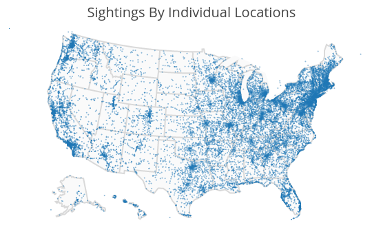
  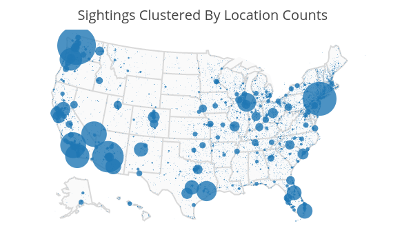


From the top left map numerous sightinings can be observed in the Pacific West and across the Midwest, Northeast, and South Regions of the United States. It helps give a general overview where most sightings have been occuring, in this case the East Coast. The top right map however, displays circles corresponding to reported sightings with the size representing the number of reports received at that specific location. Larger circles appear in Washington, the Southern West Region, Texas, the Great Lakes in the East North Central Division, Florida, and in the North East Region by New York and New Jersey. Let's now look at all sightings by state.

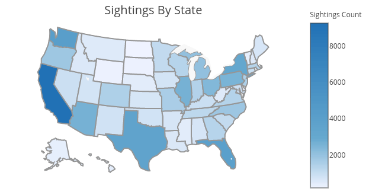

States shaded darker in the map above have had more reported sightings across the years 1965 - 2013. The table below summarizes the map into the top 5 states with most reported sightings and the top 5 cities that contributed to their sightings count.

| **California - 9,477** | **Washington - 4,192** | **Florida	- 4,148** | **Texas - 3,592** | **New York - 3,142** |
|---|---|---|---|---|
| Los Angeles - 449 | Seattle - 660 | Miami - 288 | Houston - 308 | New York - 518 |
| San Diego - 379 | Tacoma - 163 | Orlando - 236 | Austin - 227 | Buffalo - 112 |
| Sacramento - 219 | Spokane - 160 | Fort Lauderdale - 163 | San Antonio - 178 | Rochester - 80 |
| San Jose - 195 | Vancouver - 141 | Jacksonville - 137 | Dallas - 156 | Albany - 46 |
| San Francisco - 195 | Everett - 103 | Tampa - 137 | El Paso - 91 | Syracuse - 40 |

As you can see from the map and table, California has the most reported sightings across all states. Referring back to the map of sightings clustered by location, you can see the size and location of the circles indeed correspond to where Los Angeles, San Diego, Sacramento, San Jose, and San Francisco would be. In fact according to Wikipedia, the cities listed in the table are among California's top largest cities by population. We can make a similar conclusion that the other cities are the most populous for their states. It's a no-brainer; high population cities = more reported sightings.

### UFO Sightings Over Time

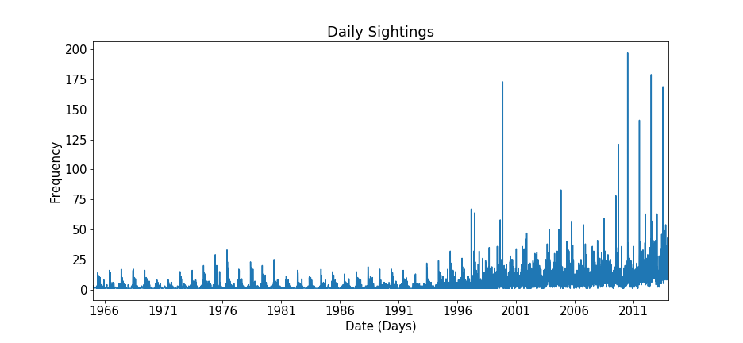

You can see fluctuations taking place sometime in middle of every year from 1965 - 2013. You'll notice that before 1995 reported sightings never exceeded 50 counts on any given day. After 1995 there's a significant increase of sightings onwards where some huge spikes lie. There's an obvious trend happening across each years, however, this plot can be a bit difficult to gain insight when looking at the data daily. Let's look into the sightings by month.

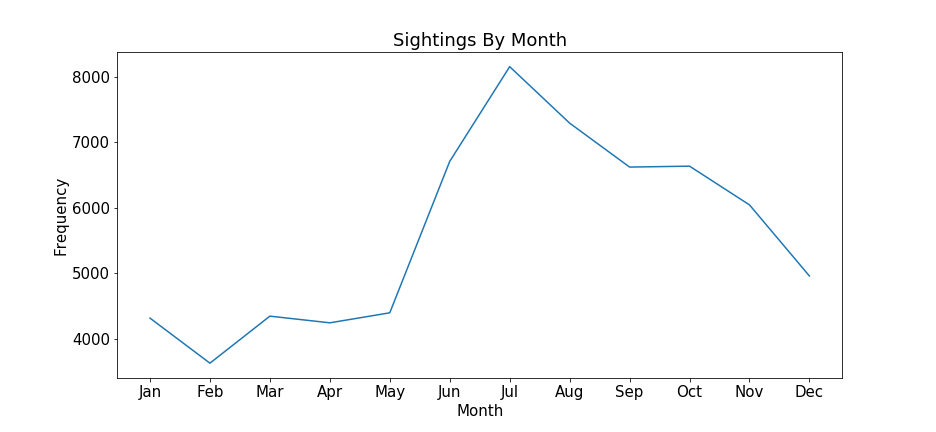

Here, all sightings from 1965 - 2013 were aggregated into one monthly plot. You can see a large increase beginning in May with the highest peak in July as it lowers down into August. Looking back at the previous plot, we now know that May - August account for the fluctuations seen across each year. In the previous section of Mapping UFO Sightings, we found that larger cities suggest more sighitngs. Now to add in the rise of sightings, the months May - August are associated with Summer where people are likely to be out and about.

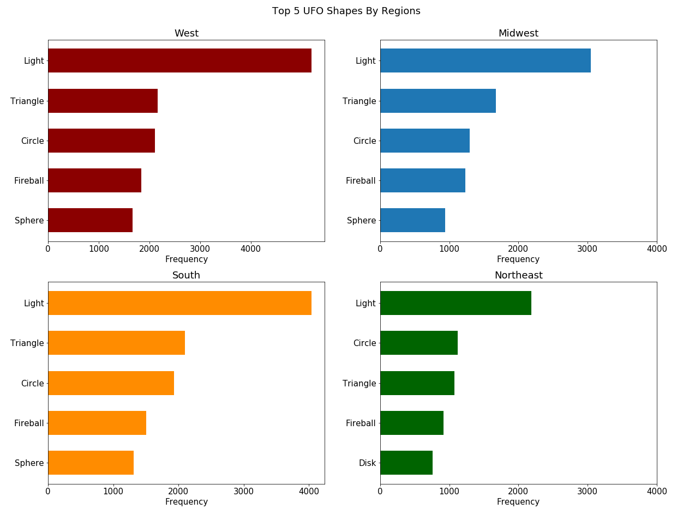

Here we can see the top UFO shapes throughout each region are the same with the exception of Disk in the Northeast. This is a bit surprising as one might expect that the geography of different regions may impact the shapes seen. It may have help to look at divisions instead, as regions might be too general. However, this gives us a good overview on the main shapes being seen. Below are examples of these different reported shapes. You can click each image to take you to it's source or here to view more recoreded UFO shapes.

{{< carousel images="{figures/ufo-shape*}" >}}

---

## Exploring Disaster Declarations

### Mapping Declared Disasters


  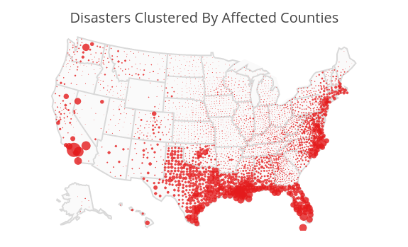
  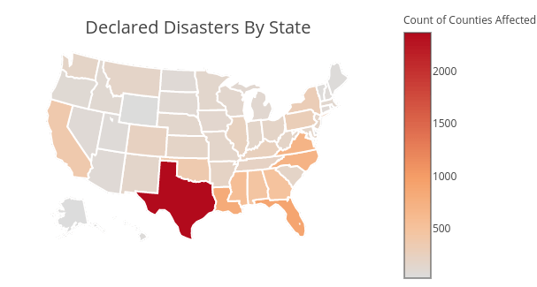


In the top left map the size of each circle corresponds to the number of disasters that affected that county from 1965 - 2013. We see the majority of disaster cases and larger circles occuring in the South and North East Regions in addition to Southern California. Accumulating all the counts of affected counties by state, the map on the right clearly shows Texas counties have been affected the most throughout this time period. The table below confers this with the top 5 states with most declared disaters affecting counties.

<!-- table -->

The table is evident of the maps above where we see these states being affected all along the Gulf and East coast of the United States. This is informative, but let's break down the disater declarations further.

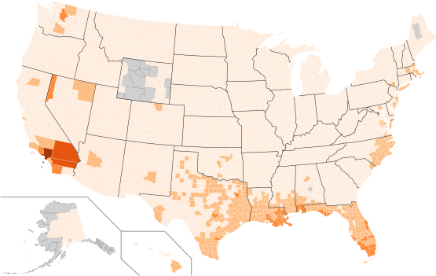

In this map we counted disaters for every county in the United States (uncolored counties were not in our data set). We can see that most counties affected by disasters follow along the Gulf Coast, but only have 8 - 24 occurences. In the bubble map that appears different, but because there is overlap between the circles. The table below shows the top 5 disaster counties.

<!-- table -->

Again, the table is clear of the map with Southern California's top 3 neighboring counties with most declared disasters. Looking into the data we find that fires make up most of these disasters. It's not too suprising as California has many fires and can be justified on FEMA's map of wildfire activity by county here. As for Collier and Monroe County in Florida they reside at the tip of the state and are more prone to Hurricanes along with the other Florida and Lousiana counties evident from the map.

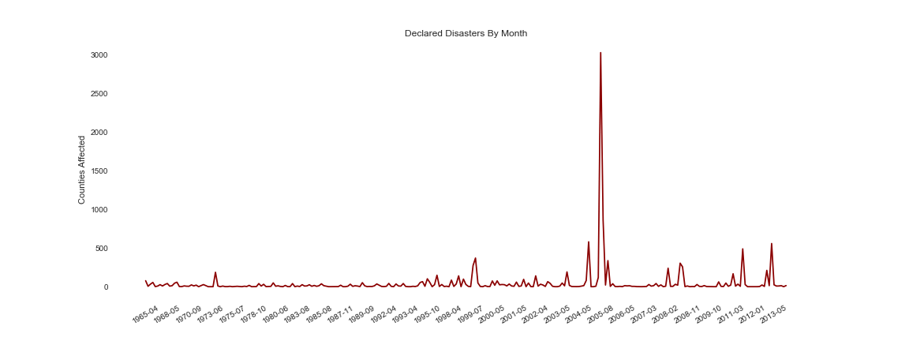

In this plot we see a low activity of declared disasters, with some ocassinaoly spikes, but more significantly we see a huge spike of affected counties in 2005 which correspond to Hurricane Katrina. You can read more about it here from the National Oceanic and Atmospheric Administration (NOAA). Below is a picture of Katrina; you can see how much area and counties the hurricane covers.

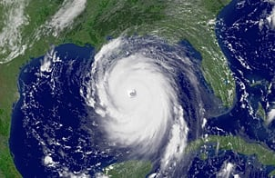

### Disaster Types By Divisions

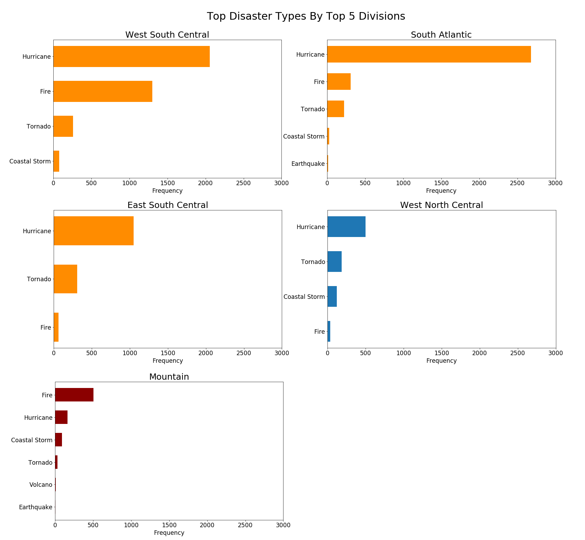

When we look at the disasters by divisions the majority belong to the South Region, evident of the previous maps. More specifically, well over 1000 counties near in the Gulf Coast have been affected by Hurricanes from 1965 - 2013. Interestingly, looking at the West North Central and Mountain Divisions we also see Hurricane as the top count. This is because counties in these divisions were also warned of Hurricane Katrina at that time. We might say that Hurricane Katrina is an anomly across all the years of data. However, we still notice tornadoes and fires occuring.

---

## Exploring UFO Sightings & Disasters

### Mapping UFO Sightings & Disasters

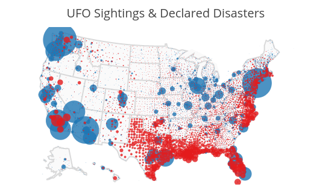

Similarly as before the size of the circles corresponds to the number of sightings and affected counties by disasters. By looking at both sightings and disasters overlayed on each other we do indeed some overlap with larger circles. We can see that major sightings area like Southern California are covered with disasters along with areas like Florida, Texas, and New York area.


  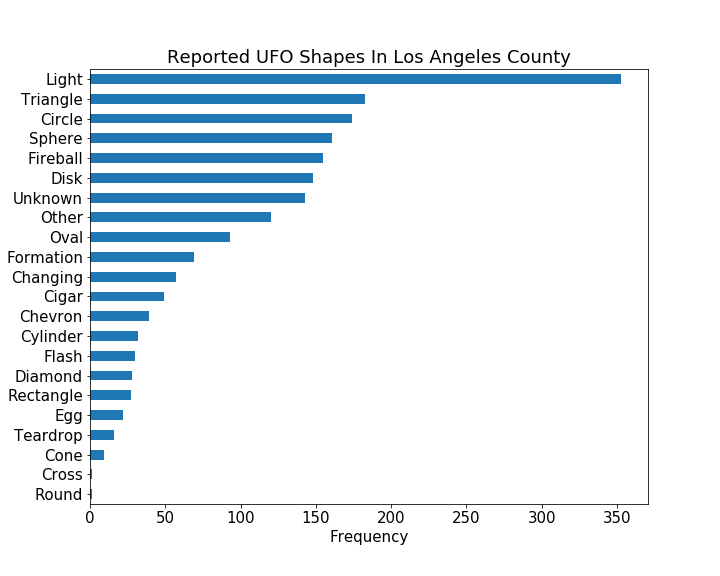
  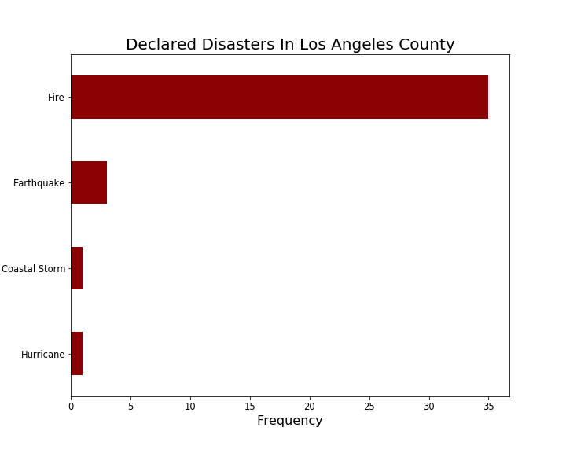


From analyzing the data sets we found Los Angeles, both the city and the county to have the most UFO Sightings and Disasters. In the above plots we see the breakdown. Again, the top 5 UFO shapes are Light, Triangle, Circle, Sphere and Fireball with fires and earthquakes as the top 2 disasters. Among these disasters there was a single report that mentions a disaster, specifically the Northridge Earthquake in 1994. It follows,

["About half an hour after the quake me my folks and I went outside. I was siting alone by a sand box when for some reason I decided to look up and as I looked up a huge fire ball travelling north to south went across the sky."](http://www.nuforc.org/webreports/105/S105280.html)

However the person reports it was only seconds worth, is it credible? Assuming same reported sightings is more credible let's explore the top sightings on a given day.

### Top UFO Sightings: Shapes & Disasters

Below we have the top 5 reported UFO sightings by multiple people from 1965 - 2013.

| **Date** | **City** | **County** | **State** | **Count** |
|---|---|---|---|---|
| 10-31-2004 | Tinley Park | Cook County | Illinois | 60 |
| 8-21-2004 | Tinley Park | Cook County | Illinois | 27 |
| 3-13-1997 | Phoenix | Maricopa County | Arizona | 25 |
| 1-11-2001 | Rockford | Winnebago County | Illinois | 18 |
| 9-30-2005 | Tinley Park  | Cook County | Illinois | 14 |

We see the top reportings occur in Tinley Park, Illinois where the first major occurence happened in August 2004. Below is one of the 27 reports made to NUFORC following from the incident and a video about the phenonmenon that occured that day.

["3 redish orange lights came out of the north and spread apart into almost a perfect triangle, then the bottom 2 seemed to connect. After this the top one started drifting upward almost hovering and then the other one did the same until they formed a perfect line in the sky and then one by one dissapeared. Then another one came 5 minutes later same thing too, except solo and started to dim and fade away just like the others. It was the weirdest thing ive ever seen. Definatly not an aircraft ive ever seen."](http://www.nuforc.org/webreports/038/S38808.html)



Another notable mention are the occurences in Pheonix, Arizona known as the Phenoix Lights. You can view a video of the occurence and interestingly enough there is a movie coming out April 2017 about the phenomenon.


 


Since Tinley Park had the most occurences, let's look at the different diasters and UFO shapes that have occured there.

| **Date Started** | **Date Ended** | **Declaration Type** | **Disaster Type** |
|---|---|---|---|
| 4-25-1967 | 4-25-1967 | Major Disaster Declaration | Tornado |
| 8-29-2005 | 1-10-2005 | Emergency Declaration | Hurricane |

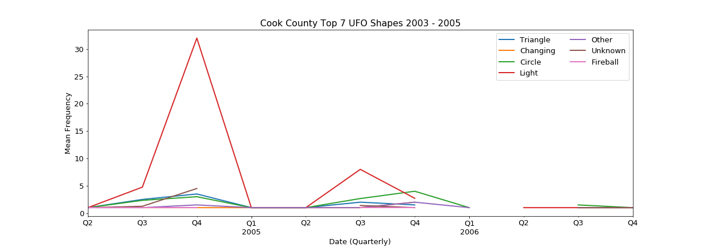

Shockingly there are only 2 declared disasters for Cook County in comparison to the phenomenon that had been occuring. The dates of these disasters don't fall to close to any of the major sightings either. Looking at the UFO shapes over time, we see that Light, Circle, and Triangle appear the most in this county. There appears to be periodic behavior happening between 3rd quarter of a year and the start of a new year.

---

## Conclusion

There are plenty of UFO cases we can still look into and try and find more overlap, however even after having connected the data sets together it's hard to make a solid conclusion. There is some overlap, but not enough to say that UFOs appear upon disasters. Maybe natural disasters aren't a significant factor in determining whether a sighting will occur. Maybe it's climate weather? Regardless, there are plenty more ways to explore the phenomeon like the time of day to even checking the "validity" of such reports with Natural Language Processing, but that's up to you. Full code and data can be found on GitHub here. Feel free to use the data sets to explore if you'd like. Please give credit by attaching a link to the repository.

--- 

I collaborated with [Ethan Bell](https://github.com/eabell94), [Zora Wang](https://github.com/zora2028), and [Madeline Ye](https://github.com/mmadet).